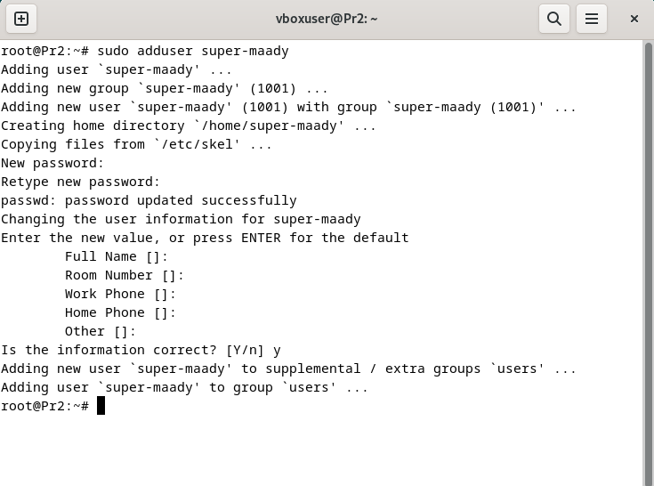
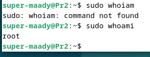
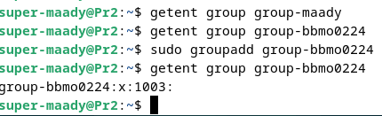
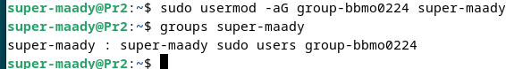
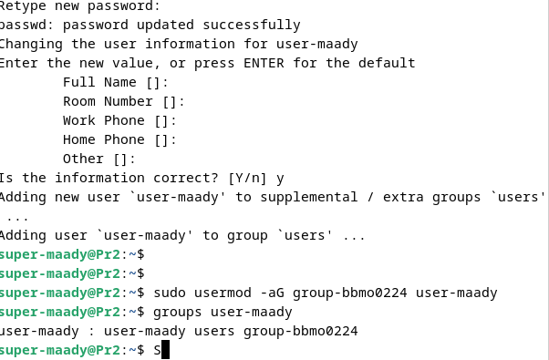
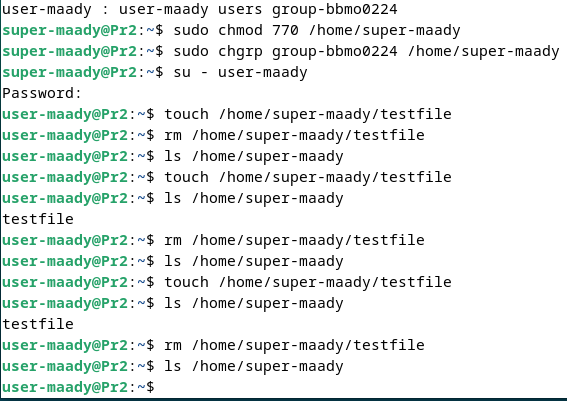

# Идентификация и аутентификация
Маады Сергей ББМО-02-24
Идентификация и аутентификация
1. Создать виртуальную машину на базе ОС Debian 12
2. Создать пользователя super-maady, наделить его привилегиями суперпользователя
3. Зайти под созданным пользователем и создать группу group-bbmo0224
4. Добавить пользователя super-maady в группу group-bbmo0224
5. Продемонстрировать наличие пользователя в группе
6. Создать пользователя user-maady, добавить его в группу group-bbmo0224
7. Наделить полномочиями (с использованием chmod) пользователя user-maady по созданию и удалению файлов в домашнем каталоге пользователя super-maady
8. Продемонстрировать работу механизмов разграничения доступа.

# Задание

